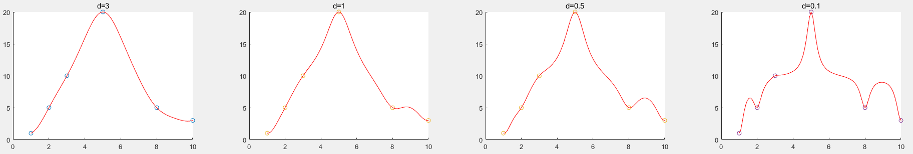

# CAGD 作业 1

刘紫檀 SA21229063

## 原理

记插值点为 $ (p_0, q_0) , (p_1, q_1), \cdots (p_{n-1}, q_{n-1}) $ 。

### 使用多项式函数插值

设用于插值的多项式函数为 $ f(x) = \sum_i a_i x^i $，则对于 $ n $ 个点的插值问题，一般情况下需要 $ n- 1  $ 次多项式。

由此，我们得到如下的线性方程组：
$$
\left\{\begin{aligned}
a_0 + a_1p_0 + a_2p_0^2 + ... + a_{n-1}p_0^{n-1} &= q_0 \\
a_0 + a_1p_1 + a_2p_1^2 + ... + a_{n-1}p_1^{n-1} &= q_1 \\
\vdots \\
a_0 + a_1p_{n-1} + a_2p_{n-1}^2 + ... + a_{n-1}p_{n-1}^{n-1} &= q_{n-1} \\
\end{aligned}
\right.
$$
整理成矩阵形式并求解即可。

### 使用 RBF 函数插值

RBF 基函数即 $ \phi(\|x-x_i\|) $ 形式的函数。此处，我们取
$$
\phi(r) = \frac{1}{r^2 + d}
$$
作为我们的 RBF 基函数。

由
$$
f(p_i) = b_0 + \sum_{j=1}^{n-1} b_j \times \frac{1}{\|p_i-p_j\|^2+d} \qquad (i = 0, \dots, n-1)
$$
得到如下的线性方程组
$$
\left\{\begin{aligned}
b_0 + \sum_i b_i \times \frac{1}{\|p_0-p_i\|^2+d} &= q_0 \\
b_0 + \sum_i b_i \times \frac{1}{\|p_1-p_i\|^2+d} &= q_1 \\
&\vdots \\
b_0 + \sum_i b_i \times \frac{1}{\|p_{n-1}-p_i\|^2+d} &= q_{n-1} \\
\end{aligned}
\right.
$$
我们提前取好 $ b_0 $ 和 $ d $ 的值，即可求解各个插值系数 $ b_i $。

#### 优化多出来的系数

对于 RBF 方法， 其拟合中多出来一些自由的参数，可以供我们选择。我们有几种思路来考虑这个问题：

##### 最小二乘确定 $ b_0 $ 或低次多项式

因为 RBF 在远距离时影响衰减到 0，所以在较远的距离函数的值将完全由 $ b_0 $ 或某个低次多项式决定。

这个时候，一个比较自然的想法就是，先使用最小二乘法确定 $ b_0 $ 或某个低次多项式使得前面的项逼近原函数，再使用 RBF 的各项来确保插值点上的值准确。这样出来的函数在比较远的距离也有比较良好的性质，如果低次多项式的次数选择得当的话。

具体地说，我们记拟合函数的形式为 

$$
f(x) = P_m(x) + \sum_j b_j \phi(\|x-p_j\|)
$$

且第一步时我们使用最小二乘法优化 $ P(x) $。如果设 

$$
P_m(x) = \sum_{i=0}^{m} a_i x^i
$$
那么即为要求 $ \sum \| P_m(p_i) -  q_i \|^2 $ 最小的 $ a_i $。这只需要解方程

$$
\mathbf K^T \mathbf K\mathbf a = \mathbf K^T \mathbf  q
$$

即可，其中 $ K $ 为 
$$
\begin{pmatrix}
1 & p_0 & p_0^2 & \cdots & p_0^{n-1} \\
\vdots & & & & \vdots\\
1 & p_{n-1} & p_{n-1}^2 & \cdots & p_{n-1}^{n-1} 
\end{pmatrix}
$$
对于仅有 $ b_0 $ 的情形，最小二乘问题的解即为将 $ b_0 $ 设为 $ \mathbf q $ 的均值。

##  结果

### 两种方法的比较

首先是插值点如下表所示的插值（$ d = 5, b_0 = 10 $）

|      | $(p_0, q_0)$ | $(p_1, q_1)$ | $(p_2, q_2)$ | $(p_3, q_3)$ | $(p_4, q_4)$ | $(p_5, q_5)$ |
| ---- | ------------ | ------------ | ------------ | ------------ | ------------ | ------------ |
| p    | 1            | 2            | 3            | 5            | 8            | 10           |
| q    | 1            | 5            | 10           | 20           | 5            | 3            |

运行 `testInterpolate.m` 可以得到如下结果

其中绿色为 RBF 插值，红色为多项式插值。

在这个例子里面，RBF 倾向于比较“平滑”的结果，其振荡较小。

### RBF 基函数中 $ d $ 的影响

使用和前面的实验中同样的插值点，我们进行如下实验（$ b_0 = 10$）

实验代码可以参见 `testRBFInterpolate.m`。我们可以看出，$ d $ 变小，插值函数 “衰减” 到 $ b_0 $ 的趋势就越明显。

如果想要比较平滑的结果，那么 $ d $ 就需要取的和 $ p_{i+1} - p_i $ 在一个数量级才行。

### 图形化选点

利用 `implot` 函数，我们可以进行交互式的插值点选择，详见代码 `testInterpolateGui.m`。

下面是一些展示：

#### 展示一

#### 展示二

## 思考

- 变量比方程多，如何增加约束条件？
  - 要根据我们对待插值函数本身性质的认识来增加。比如在 RBF 中 d 的选取，我们就要根据我们对函数局部的振荡性质的认识，来选择比较贴合函数本身的 $ d $。
- 常数项为低次多项式时，如何确定约束条件？
  - 可以用前述的最小二乘方法来确定约束条件。