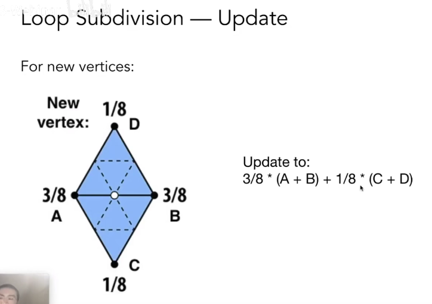
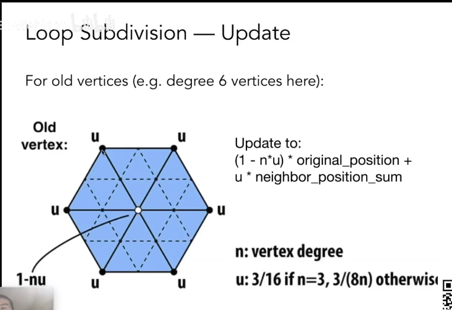
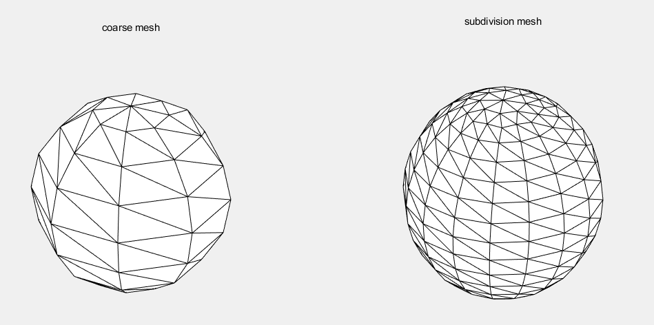

# CAGD 作业 9
刘紫檀 SA21229063

## 问题一

实现 Loop 三角网格细分算法。给定低分辨率三角网格，用Loop细分算法进行多次细分得
到高分辨率光滑网格。

> 参考文献
> 
> Stam 1998. Evaluation of Loop Subdivision Surfaces

### 分析

1. 首先对每个三角形，利用三个中点将一个三角形细分成为四个

2. 对于新生成的顶点，采用如下公式进行更新

   

3. 对于原来的顶点，采用如下公式进行更新（图源 GAMES101）

   

4. 得到结果

> 实际在 MATLAB 写的时候还是比较 tricky 的，尤其 MATLAB 没有好用的半边数据结构，导致找邻接关系之类的要花很多脑细胞

### 结果展示

