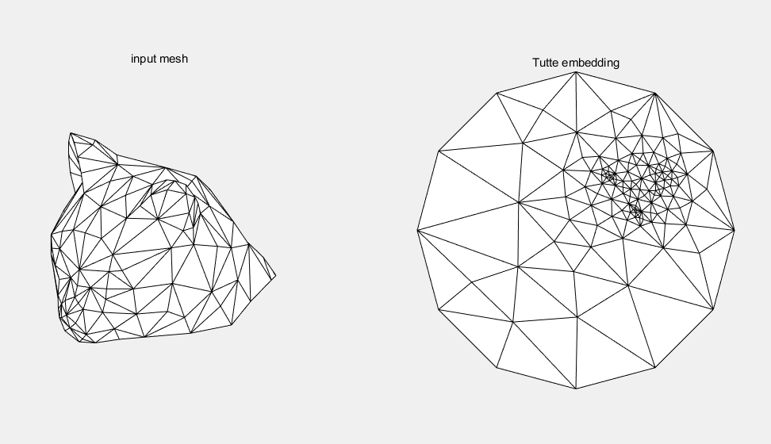

# CAGD 作业 11

刘紫檀 SA21229063

## 内容

实现 Tutte 参数化，均匀权重。

## 方法

首先找到边界，固定到圆周的各个点上，然后内部点需要和其邻居的平均值一致，这样凑成的 $ A x = b $ 进行求解即可，其中 A 为 `numVertices x numVertices`，b 为 `numVertices x 2`。

> Trick: 用 Matlab 的 [laplacian()](https://ww2.mathworks.cn/help/matlab/ref/graph.laplacian.html) 函数可以返回图拉普拉斯矩阵，里面既有度又有邻接关系，非常好用
>
> - （不过我没用..）

## 实验结果

