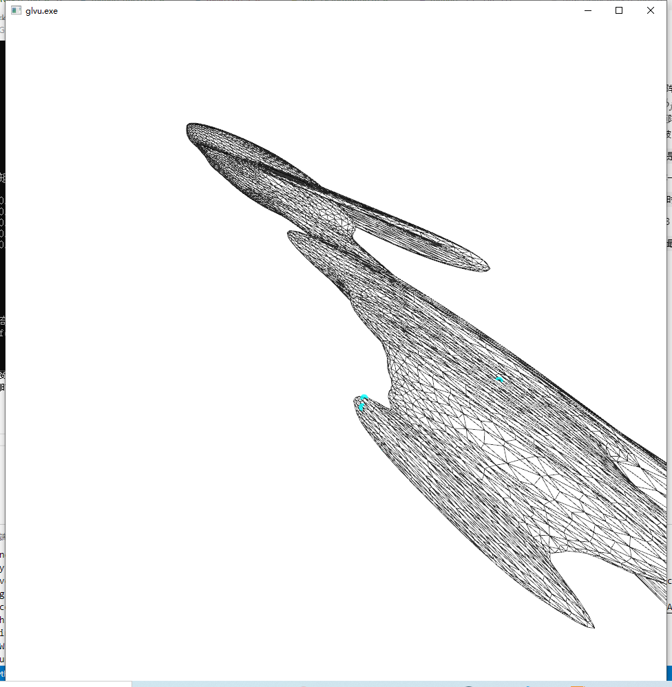

# CAGD 作业 12

刘紫檀 SA21229063

## 内容

实现 RBF Mesh Deformation

> 参考 Botsch and Kobbelt 2005. Real-Time Shape Editing using Radial Basis Functions

## 推导

输入是一些点对，列约束方程

$$
\begin{pmatrix}
\Phi & P \\
P^T & 0 \\
\end{pmatrix}

\begin{pmatrix}
w_j \\
q_j
\end{pmatrix}
=
\begin{pmatrix}
b_i \\
0
\end{pmatrix}
$$

其中：
- $ \Phi $ 为 m x m 矩阵，定义为 $ \Phi_{ij} = \phi_j(c_i) $ 
  - 定义为 $ \phi_j(c_i) = \| c_i - x_j \|^{3}_2 $
- $ P $ 为 m x 10 矩阵，定义为 $ P_{ij} = p_j (c_i) $
  - $ p_j(c_i) $ 被 $ \{1, x, y, z, x^2, y^2, z^2, xy, xz, yz \} $ 张成

> 有二次项炸的实在是太厉害。。最后都改成 4 维， 被 $ \{1, x, y, z\} $ 张成了。

用 $ A^T Ax = A^T b $ 求一个最小二乘解来解决秩不够的问题。
> 但是这样约束少的时候可能比想象中的鬼畜，因为优化的能量在人眼看起来不是最优的。

同时令输入点数少于 3 时不动作，方便拖动一些初始点。
> 不然点少的时候用最小二乘炸的太厉害..

## 结果展示

手上拽了四个点..可以看到点确实被拽过去了。

> 但是这个 RBF 基函数的支集是 $ R^3 $，对于这个问题来说有点过于恐怖了，感觉明显做个 cutoff 合适的多，比如选 Gaussian RBF。

一个稍微能看出人形的五个点的例子。