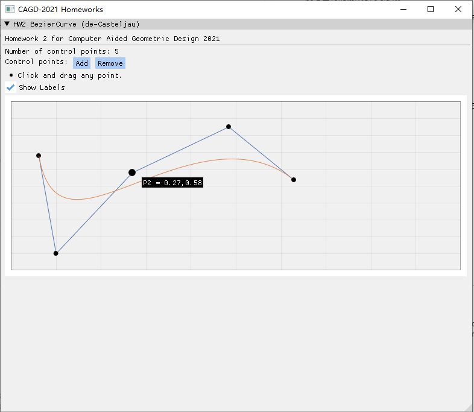

# CAGD 作业 2

刘紫檀 SA21229063

## 原理

使用 de Casteljau 算法计算 Bezier Curve 上任意一点的坐标。

### 算法输入

给定控制点集合 $ {P}_{i} $ $(i = 0, \dots , n)$，我们想求曲线上 $ t $ 处的值 $ c(t) $，构造 $ B_i^n $ 如下：

$$
\begin{aligned}
&b_i^0(t) = P_i & i = 0, \dots , n \\
&b_i^r(t) = (1-t) b_i^{r-1}(t) + t b_{i+1}^{r-1}(t) & r = 1, \dots, n \quad i = 0, \dots, n
\end{aligned}
$$

则 $ b^n_0(t) $ 即为所求 $ c(t) $ 的值。

### 计算步骤

在计算时我们可以采用动态规划 (DP) 的求解策略，观察到计算 $ b_r(t) $ 只需要 $ b_{r-1}(t) $ 的值。这样，我们在计算每个采样点 $ t $ 的值 $ c(t) $ 时只需要 $ O(n) $ 的空间复杂度，其中 $ n $ 为控制点个数。

## 框架介绍

本次实验我采用了 ImGui + glfw + ImPlot 来进行。代码采用 C++11 兼容的写法，使用 CMake 编译运行。

ImGui 是一个优秀的立即模式 GUI 库，配合 glfw 和 OpenGL backend 可以达到比较好的性能，也十分方便与已有的游戏引擎集成。

> 关于立即模式，可以搜索 immediate mode gui library vs retained mode gui library

### 如何编译运行

要求：
- CMake 3.5+
- Visual Studio 2019

CMake Configure & Build 即可。`hw-main` 为主程序。

## 结果

下面是一些展示：

### 交互式拖动中

### 添加更多的控制点

