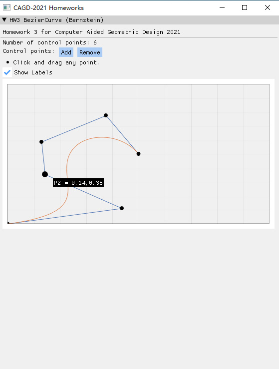

# CAGD 作业 3

刘紫檀 SA21229063

## 原理

使用 Bernstein 基函数计算 Bezier Curve 上任意一点的坐标。

### 算法输入

给定控制点集合 $ {P}_{i} $ $(i = 0, \dots , n)$，我们想求曲线上 $ t $ 处的值 $ \mathbf{c}(t) $，则我们使用

$$
\begin{aligned}
&\mathbf{c}(t) = \sum_{i=0}^n b_{i, n}(t)\mathbf{P}_i,\ \ \ 0 \le t \le 1
\\
&b_{i,n}(t) = C_n^i t^i (1 - t)^{n - i},\ \ \ i = 0, \ldots, n
\end{aligned}
$$

### 实现说明

$$
C_n^i = \frac{n!}{(n-i)!i!}
$$

计算组合数 $ C_n^i $ 时候用一个预制的阶乘查找表（来偷懒）。

## 框架介绍

本次实验我采用了 ImGui + glfw + ImPlot 来进行。代码采用 C++11 兼容的写法，使用 CMake 编译运行。

ImGui 是一个优秀的立即模式 GUI 库，配合 glfw 和 OpenGL backend 可以达到比较好的性能，也十分方便与已有的游戏引擎集成。

> 关于立即模式，可以搜索 immediate mode gui library vs retained mode gui library

### 如何编译运行

要求：
- CMake 3.5+
- Visual Studio 2019

CMake Configure & Build 即可。`hw-main` 为主程序。

## 结果

下面是一些展示：

### 交互式拖动中

### 添加更多的控制点

## 问题

### 一条 Bézier 曲线的弧长不大于其控制多边形的周长

$$
\begin{aligned}
\int_0^1 \sqrt{(\mathbf{c}_x'(t))^2 + (\mathbf{c}_y'(t))^2} dt
&= \int_0^1 || (\sum_{i=0}^n C_n^i t^i (1 - t)^{n - i} \mathbf{P}_{i})’||_2 dt\\
&= \int_0^1 || (\sum_{i=0}^n C_n^i t^i (1 - t)^{n - i} \mathbf{P}_{i})’||_2 dt\\
&= \int_0^1 || \sum_{i=0}^n C_n^i t^{i-1} (1-t)^{n-i-1} (i-tn) \mathbf{P}_{i} ||_2 dt\\
&= \int_0^1 || \sum_{i=0}^n n C_{n-1}^{i-1} t^{i-1} (1-t)^{n-i} - nC^{i}_{n-1} t^{i} (1-t)^{n-i-1} \mathbf{P}_{i} ||_2 dt\\
&= \int_0^1 || \sum_{i=0}^n n B_{i-1}^{(n-1)}(t) - n B_{i}^{(n-1)}(t) \mathbf{P}_{i} ||_2 dt\\
&= \int_0^1 || \sum_{i=0}^{n-1} n B_{i}^{(n-1)}(t)( \mathbf{P}_{i+1} - \mathbf{P}_{i}) ||_2 dt \quad (上面左边换下标，然后整理项)\\
&\le \int_0^1  \sum_{i=0}^{n-1} || n B_{i}^{(n-1)}(t)( \mathbf{P}_{i+1} - \mathbf{P}_{i}) ||_2 dt \\
&= \int_0^1  \sum_{i=0}^{n-1}  n B_{i}^{(n-1)}(t) ||( \mathbf{P}_{i+1} - \mathbf{P}_{i}) ||_2 dt \\
&= \sum_{i=0}^{n-1} ||( \mathbf{P}_{i+1} - \mathbf{P}_{i}) ||_2 \int_0^1  n B_{i}^{(n-1)}(t)  dt \\
&= \sum_{i=0}^{n-1} ||( \mathbf{P}_{i+1} - \mathbf{P}_{i}) ||_2 \int_0^1  n B_{i}^{(n-1)}(t)  dt \\
&= \sum_{i=0}^{n-1} ||( \mathbf{P}_{i+1} - \mathbf{P}_{i}) ||_2 n C_{n-1}^{i} \frac{\Gamma(i+1)\Gamma(n-i)}{\Gamma(n+1)} \\ 
&= \sum_{i=0}^{n-1} ||( \mathbf{P}_{i+1} - \mathbf{P}_{i}) ||_2 n C_{n-1}^{i} \frac{i!(n-i-1)!}{n!} \\ 
&= \sum_{i=0}^{n-1} ||( \mathbf{P}_{i+1} - \mathbf{P}_{i}) ||_2
\end{aligned}
$$

证明完毕。

### 圆弧不能用 Bézier 曲线精确表示

比较显然。考虑圆（或者圆弧）的参数方程（$ t \in [\theta_0, \theta_1] $）
$$
\left\{
\begin{aligned}
x(t) &= r \cos t + x_0\\
y(t) &= r \sin t + y_0
\end{aligned}
\right.
$$
如果该圆弧可以被 Bezier 曲线表示，则有
$$
\left\{
\begin{aligned}
r \cos t + x_0 = \sum_{i=0}^n b_{i, n}(t)\mathbf{P}_{ix}\\
r \sin t + y_0 = \sum_{i=0}^n b_{i, n}(t)\mathbf{P}_{iy}\\
\end{aligned}
\right.
$$
右边是关于 $ t $ 的有限次多项式，而左边由三角函数的泰勒展开，我们知道三角函数不能被有限项多项式表示（否则到某项之后就为 0 了），所以圆弧不能用 Bezier 曲线精确表示。

### 平面 n 次 Bézier 曲线及其控制顶点首末顶点与原点所围成的区域的面积

用格林公式转换为线积分然后算就行，TODO