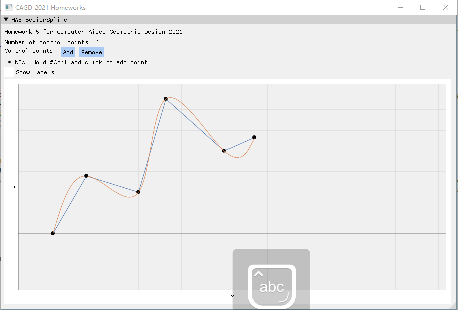

# CAGD 作业 5

刘紫檀 SA21229063

## 题目

> 第二题要证明的结论似乎存在一些问题，所以没有做。

证明 ：设 $ f(x) \in C^2[a, b] $ 是任一被插值函数，$ S(x) $ 是自然插值三次样条函数（端点条件为二阶导数为 0），则有
$$
\int_a^b[S''(x)]^2 dx \le \int_a^b [f''(x)]^2 dx
$$
证明：因为
$$
\begin{aligned}
0 \le \int_a^b (f''(x)-S''(x))^2 dx &= \int_a^b f''(x)^2 dx- 2\int_a^b(f''(x)-S''(x))S''(x)dx-\int_a^bS''(x)^2 dx
\end{aligned}
$$
中间这项其实可以分段拆出来（三次样条函数是分段 $ P^3 $ 的，自然二阶导是线性函数，三阶导是常数）
$$
\begin{aligned}
\int_a^b(f''(x)-S''(x))S''(x)dx&=\sum_{i=1}^{n} \int_{x_{i-1}}^{x_i}(f''(x)-S''(x))S''(x)dx \\
&=\sum_{i=1}^{n} [(f'(x)-S'(x))S''(x)] \bigg|^{i}_{i-1} - \sum_{i=1}^n \int_{x_{i-1}}^{x_i} (f'(x) - S'(x)) S'''(x) dx \\
&=\sum_{i=1}^{n} [(f'(x)-S'(x))S''(x)] \bigg|^{i}_{i-1} - \sum_{i=1}^n S'''_i\int_{x_{i-1}}^{x_i} (f'(x) - S'(x))  dx \\
&=\sum_{i=1}^{n} [(f'(x)-S'(x))S''(x)] \bigg|^{i}_{i-1} - \sum_{i=1}^n S'''_i [f(x)-S(x)] \bigg|_{i-1}^{i} \\
&=\sum_{i=1}^{n} [(f'(x)-S'(x))S''(x)] \bigg|^{i}_{i-1} \quad (\because \forall i,f(x_i) = S(x_i)) \\
&= [(f'(x_n)-S'(x_n))S''(x_n)]-[(f'(x_0)-S'(x_0))S''(x_0)]  \\
&= 0 \quad (\because \text{natural b.c.})  \\
\end{aligned}
$$
所以
$$
\int_a^b[S''(x)]^2 dx \le \int_a^b [f''(x)]^2 dx
$$
成立。

## 实验

### 目标

构造交互式的 3 阶 Bezier 样条曲线绘制程序。

### 原理

3 阶 Bezier 样条曲线，即为一条参数曲线 $ \mathbf{f}(t) $，其经过 $ \mathbf{k_0}, \mathbf{k_1}, ..., \mathbf{k_n} $，且满足如下条件
- 任意的 $ \mathbf{k_i} $ 到 $ \mathbf{k_{i+1}} $ 间均为 3 阶 Bezier 曲线
- 曲线满足 $ C^2 $ 连续性

我们设第 $ i $ （$i=0,...,n-1$）段 Bezier 曲线的控制点为 $ \{ p^{(i)}_j \}_{j=0}^3 $（我们要求 $ C^0 $ 连续，则 $ p_3^{(i)} = p_0^{(i+1)}$），同时记第 $ i $ 段 Bezier 的局部参数化形式为 $ \mathbf{y}_{(i)}(t) $，则有
$$
f(t) = \mathbf{y}_{(i)}(\frac{t-t_i}{t_{i+1} - t_{i}}) \quad t \in [t_i, t_{i+1}]
$$
成立，其中我们约定 $ \mathbf{x}(t_i) = \mathbf{k_i} $，$ t_i < t_j $ 如果 $ i < j$。

如此一来，我们一共有 $ 3n+1 $ 个未知数，分别对应该样条曲线的所有控制点 $ \{ p^{(i)}_j \}_{j=0}^3 $。

由 $ \mathbf{x}(t_i) = \mathbf{k_i} $，我们有如下等式成立（共 $ n+1 $ 个）

$$
\begin{aligned}
&p_0^{(i)} = k_i & i = 0, ..., n-1 \\
&p_3^{(n-1)} = k_{n}
\end{aligned}
$$

由 $ C^1 $ 连续，我们有如下等式成立（共 $ n-1 $ 个）
$$
\begin{aligned}
&\frac{p_{3}^{(i-1)}-p_{2}^{(i-1)}}{t_i - t_{i-1}} = \frac{p_{1}^{(i)}-p_{0}^{(i)}}{t_{i+1} - t_{i}} & i = 1, ..., n-1
\end{aligned}
$$
由 $ C^2 $ 连续，我们有如下等式成立（共 $ n - 1 $ 个）
$$
\begin{aligned}
&\frac{p_3^{(i-1)}-2p_2^{(i-1)}+p_1^{(i-1)}}{t_i - t_{i-1}} = \frac{p_2^{(i)}-2p_1^{(i)}+p_0^{(i)}}{t_{i+1} - t_{i}} & i = 1, ..., n-1
\end{aligned}
$$
然后再加上自然边界条件
$$
\begin{aligned}
&x''(t_0) = 0 \iff p_2^{(0)} - 2p_1^{(0)} + p_0^{(0)} = 0 \\
&x''(t_n) = 0 \iff p_1^{(n-1)} - 2p_2^{(n-1)} + p_3^{(n-1)} = 0 \\
\end{aligned}
$$
就可以得到所有的控制点，进而画出曲线。控制点共有 $ 3n+1 $ 个，需要 $ (3n+1) \times \dim(\mathbf{k_i}) $ 个方程。不过其实 $ p_x $ 和 $ p_y $ 所做变换完全相同，所以可以看成是对 $ p = [p_x\quad p_y] $ 进行求解，然后再弄出来。

> 由于时间限制，只实现了自然边界条件和 Uniform 参数化。

### 框架介绍

本次实验我采用了 ImGui + glfw + ImPlot 来进行。代码采用 C++11 兼容的写法，使用 CMake 编译运行。

ImGui 是一个优秀的立即模式 GUI 库，配合 glfw 和 OpenGL backend 可以达到比较好的性能，也十分方便与已有的游戏引擎集成。

> 关于立即模式，可以搜索 immediate mode gui library vs retained mode gui library

#### 如何编译运行

要求：

- CMake 3.5+
- Visual Studio 2019

CMake Configure & Build 即可。`hw-main` 为主程序。

### 结果

下面是一些展示：

