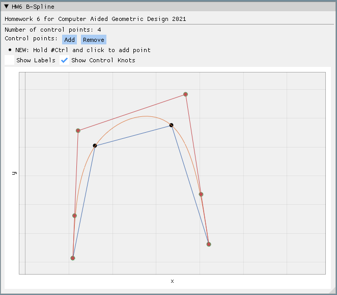
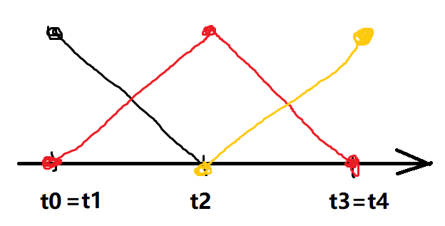
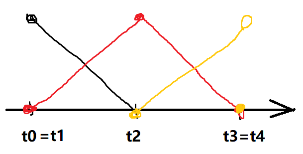

# CAGD 作业 6

刘紫檀 SA21229063

## 目标

进行 piecewise cubic 的 B 样条曲线交互式插值程序的编写。

## 原理

B 样条选用如下基函数：

$$
N_{i, 1} = \left\{ 
\begin{aligned}
& 1 & t \in [t_i, t_{i+1}] \\
& 0 & \text{otherwise}
\end{aligned}
\right.

\\
N_{i, k} = \frac{t-t_i}{t_{i+k-1}-t_i} N_{i, k-1} + \frac{t_{i+k} - t}{t_{i+k} - t_{i+1}} N_{i+1, k-1}
$$

此时，曲线可以表示成为如下形式
$$
x(t) = \sum_{i=0}^n N_{i,k}(t) d_i \quad t \in \cap_{i}\ \text{supp}\{N_{i,k}\}
$$
其中 $ d_i $ 为第 $ i $ 个控制点（$ i = 0, \dots, n$）

### de Boor 算法

展开上面的表达式，可以得到如下算法：

$$
\begin{aligned}
&d_i^{j} = ( 1 - \alpha_i^j ) d_{i-1}^{j-1} + \alpha_i^j d_{i}^{j-1} \\
&\text{where} \ \alpha_i^j = \frac{t-t_i}{t_{i+k-j} - t_i}\ \text{and}\ d_i^0 = d_i \\
\end{aligned}
$$

用上面的递推式求得 $ d_r^{k-1} $ 即为 $ x(t) $ 的值。

### 分片 $ C^2 $ 连续插值

给定 $ \{d_i\}_{i=0}^n $ ，我们需要获得如下问题的解：

$$
\begin{aligned}
&x(s_i) = d_i & i = 0, \dots, n \\
&x(s) \in C^2 & s \in [s_0, s_n]
&
\end{aligned}
$$
且我们希望我们的函数 $ x(t) $ 为 B 样条。

由于 $ k $ 阶 B 样条为 $ C^{k-2} $ 阶连续，为了达到 $ C^2 $ 连续，我们需要让 $ k = 4 $。

同时，我们希望 $ x(s_0) = d_0 $ 且 $ x(s_n) = d_n $，但是我们知道对于一般的 B 样条来说，$ t $ 的定义域位于 $ [t_{k}, t_{k+n}] $，这样我们取节点函数为 $ (s_0, \dots , s_0, s_1, \dots, s_n, \dots, s_n) $，其中 $ s_0 $ 和 $ s_n $ 分别重复 $ k $ 次，这样就可以达到 $ x(s_0) = d_0 $ 和 $ x(s_n) = d_n $ 且 $t \in [s_0, s_n ] $ 都有 $ C^{k-2} $ 连续的效果了。

此时，我们对于 $ k = 4 $ 的问题，有如下方程成立：

$$
\left\{
\begin{aligned}

x(s_0) &= d_0 \\
x(s_i) &= N_{i, 4}(s_i) d_i + N_{i+1, 4}(s_{i}) d_{i+1} + N_{i+2, 4}(s_{i}) d_{i+2} \\
x(s_n) &= d_{n+2}

\end{aligned}
\right.
$$
> 因为 $ N_{i-1}(s_i) d_i = 0 $，所以只有三项

解此方程即可。

$ N_{i, 4} $ 计算如下：

$$
\begin{aligned}
N_{i, 2} &= \frac{t-t_i}{t_{i+1}-t_i} N_{i, 1} + \frac{t_{i+2} - t}{t_{i+2} - t_{i+1}} N_{i+1, 1} \\
&= \frac{t-t_i}{t_{i+1}-t_i} N_{i, 1} + \frac{t_{i+2} - t}{t_{i+2} - t_{i+1}} N_{i+1, 1} \\
&= \left\{
\begin{aligned}
&\frac{t-t_i}{t_{i+1}-t_i} &t \in [t_i, t_{i+1}] \\
&\frac{t_{i+2} - t}{t_{i+2} - t_{i+1}} &t \in [t_{i+1}, t_{i+2}] \\
&0 & \text{otherwise}
\end{aligned}
\right.
\\

N_{i ,3} &= \frac{t-t_i}{t_{i+2}-t_i} N_{i, 2} + \frac{t_{i+3} - t}{t_{i+3} - t_{i+1}} N_{i+1, 2} \\
&= \left\{
\begin{aligned}
&\frac{t-t_i}{t_{i+2}-t_i} \frac{t-t_i}{t_{i+1}-t_i} &t \in [t_i, t_{i+1}] \\
&\frac{t-t_i}{t_{i+2}-t_i} \frac{t_{i+2} - t}{t_{i+2} - t_{i+1}} + \frac{t_{i+3} - t}{t_{i+3} - t_{i+1}} \frac{t-t_{i+1}}{t_{i+2}-t_{i+1}} &t \in [t_{i+1}, t_{i+2}] \\
&\frac{t_{i+3} - t}{t_{i+3} - t_{i+1}} \frac{t_{i+3} - t}{t_{i+3} - t_{i+2}} &t \in [t_{i+2}, t_{i+3}] \\
&0 & \text{otherwise}
\end{aligned}
\right.
\\

N_{i, 4} &= \frac{t-t_i}{t_{i+3}-t_i} N_{i, 3} + \frac{t_{i+4} - t}{t_{i+4} - t_{i+1}} N_{i+1, 3} \\
&= \text{太长了，就不写了吧}
\end{aligned}
$$

> 写完才意识到其实这个可以在程序里面动态求，没必要全展开再编程，也未必快

## 结果展示



## PITFALL

实现的时候一个坑是这样：

```c
double computeN(const Eigen::VectorXd& tKnots, double t, int i, int k) {
  if (k == 1) {
    if (tKnots(i) <= t && tKnots(i+1) > t) {
      return 1.0;
    } else {
      return 0.0;
    }
  } else {
    double left = 0.0;
	left = tKnots(i + k - 1) - tKnots(i) == 0.0 ? 0.0 : (t - tKnots(i)) / (tKnots(i + k - 1) - tKnots(i)) * computeN(tKnots, t, i, k - 1);

	double right = 0.0;
	right = tKnots(i + k) - tKnots(i + 1) == 0.0 ? 0.0 : (tKnots(i + k) - t) / (tKnots(i + k) - tKnots(i + 1)) * computeN(tKnots, t, i + 1, k - 1);

	return left + right;
  }
}
```

这个方案在多重边界节点的情况下是有问题的。

先考虑一个基础问题，$ N_{i, 1} $ 的区间问题，如果取 $ [t_i, t_{i+1}] $ 为 1 的话，$ N_{i, 2} $ 在 $ t=t_{i+1} $ 的时候的值会有一个跳变（如果是均匀网格且 $ h = 1 $ 的话，那就是 2，而左右的极限都是 1 ），所以 $ [t_i, t_{i+1}] $ 不是很合适。不过，可以考虑用  $ [t_i, t_{i+1}) $ ，如上面的做法。

但是，这个做法又有什么问题呢？如果现在是 $ k = 2, n = 2 $ 的一个多重节点方案的话，那就是有 $ t_0 = t_1 < t_2 < t_3 = t_4 $，此时我们希望基函数是如下所示



而不是



（这俩的区别在于黄色的基函数在 $ t_3 $ 的值为 1 还是为 0）

显然，后者是没法正确采样到 $ t=t_3 $ 处的节点的值的。$ t_3 \rightarrow t_4 $ 的时候 $ N_{2, 2} $ 的第二项被粗暴的处理成了 0（如上面代码），在这里就会出现问题。那么，应该怎么办才好呢？

一个启发是，我们挑一个 $ C^0 $ 连续的 $ N $ 当起点往上定义，因为 $ C^0 $ ，如果我们有一半区间（如 $ [t_0, t_1] $ ）被挤到了测度为 0 的一个点的话，我们可以用另一半来"恢复"这一点的值。这样就可以得到处处有良好定义的 $ C^0 $ 的 B 样条基函数了。也就是这样：

```c
  inline double computeN(
    const Eigen::VectorXd& tKnots,
    double t,
    int i,
    int k
  ) {
    double res;
    if (k == 2) {
      if (tKnots(i) <= t && tKnots(i+1) >= t && tKnots(i) != tKnots(i+1)) {
        res = (t - tKnots(i)) / (tKnots(i+1) - tKnots(i));
      } else if (tKnots(i+1) <= t && tKnots(i+2) >= t && tKnots(i+1) != tKnots(i+2)) {
        res = (tKnots(i+2) - t) / (tKnots(i+2) - tKnots(i+1));
      } else {
        res = 0;
      }
      return res;
    }

    double leftTerm = 0;
    {
      assert(i + k - 1 < tKnots.size());
      double dividend = tKnots(i+k-1) - tKnots(i);
      if (dividend == 0) {
        leftTerm = 0;
      } else {
        double Nres = computeN(tKnots, t, i, k-1);
        leftTerm = (Nres == 0) ? 0 : (t - tKnots(i)) / dividend * Nres;
      }
    }

    double rightTerm = 0;
    {
      assert(i + k < tKnots.size());
      double dividend = tKnots(i+k) - tKnots(i+1);
      if (dividend == 0) {
        rightTerm = 0;
      } else {
        double Nres = computeN(tKnots, t, i+1, k-1);
        rightTerm = (Nres == 0) ? 0 : (tKnots(i+k) - t) / dividend * Nres;
      }
    }

    return leftTerm + rightTerm;
  }
```

那么我们用这个 Scheme 就可以修好 $ N_{i, 2} $ 的情况，但是可以证明对于 $ N_{i, 4} $ 的情况也好用。原因如下：

考虑一个最简单的 $ k =4 $ 的多重边界点的情况，即 $ t_0 = t_1 = t_2 = t_3 < t_4 < t_5 = t_6 = t_7 = t_8 $，此时当然会遇到比如计算 $ N_{0, 2} $ 的情况，但是这个值不重要，因为比如求取 $ N_{1, 4} $ 的时候需要 $ N_{1, 3} $ 需要 $ N_{1,2} $，但是此时 $ N_{1,2} $ 前面的系数是 $ C/0$ 形式，会被赋值为 0，所以有影响的是诸如 $ N_{2, 3} $ ，最后是从 $ N_{2, 2} $ 来的值，这样根据 $ C^0 $ 补出来的那个点 $ t_3 $ 的函数值就是正确的，所以这个求取 $ N $ 的方法没问题。

鉴别这种问题的最好方法就是调一个很低的采样数，然后观察恰好等于端点的值是否能正确求解。

