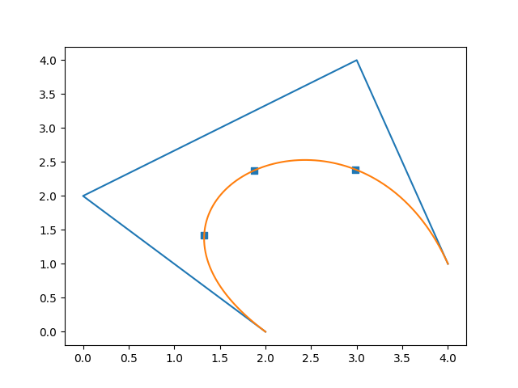
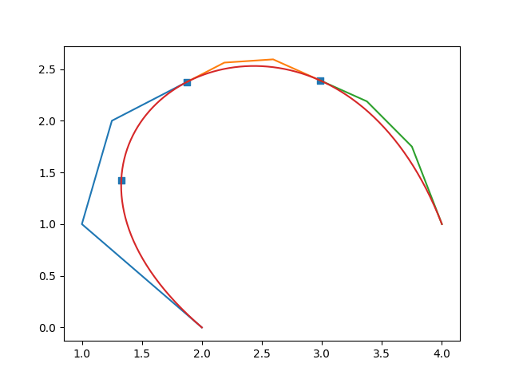

# CAGD 作业 7

刘紫檀 SA21229063

## 第一题

给定以下三次多项式曲线
$$
P(u) = - \left( \begin{array}\\ 7/8 \\ 5/8 \end{array} \right) u^3 + \left( \begin{array}\\ 9 \\ 15/4 \end{array} \right) u^2 - \left( \begin{array}\\ 57/2 \\ 9/2 \end{array} \right) u + \left( \begin{array}\\ 30 \\ -1 \end{array} \right)
$$

1. 计算 P(u) 的极形式及其在区间 [2, 4] 内的 Bezier 控制多边形的顶点 $ P_0 $, $ P_1 $, $ P_2 $, $ P_3 $，并大致勾勒出该控制多边形
2. 用 de Casteljau 算法计算在采样点 $ u = \{ 5/2, 3, 7/2 \}  $ 处的多项式曲线 $P(u)$ ，并在 (1) 的图中画出
3. 用 (2) 中结果将曲线在 $ u = 3 $ 处细分，再将右边部分曲线在中点 $ u = 7/2 $ 处细分。将控制多边形在 (1) 图中画出，并且画出 $ P(u ) $ 表示的曲线

### 1

对于 $ P(u) = au^3 + bu^2 + cu + d $ 我们有极形式
$$
P(t_1, t_2, t_3) = a t_1 t_2 t_3 + \frac{1}{3} b t_1 t_2 + \frac{1}{3} b t_1 t_3 + \frac{1}{3} b t_2 t_3 + \frac{1}{3}c t_1 + \frac{1}{3} c t_2 + \frac{1}{3} c t_3 + d
$$
那么我们的极形式计算如下：
$$
\begin{aligned}
P(t_1, t_2, t_3) &= - \left( \begin{array}\\ 7/8 \\ 5/8 \end{array} \right) (t_1 t_2 t_3) + \left( \begin{array}\\ 9 \\ 15/4 \end{array} \right) (\frac{t_1 t_2 + t_2 t_3 + t_1 t_3}{3}) - \left( \begin{array}\\ 57/2 \\ 9/2 \end{array} \right) (\frac{t_1 + t_2 + t_3}{3}) + \left( \begin{array}\\ 30 \\ -1 \end{array} \right) \\
&= 懒得展开了，用处不大
\end{aligned}
$$
在 [2, 4] 内的控制多边形的顶点计算如下：

$$
\begin{aligned}
P(2, 2, 2) &= \left( \begin{array}\\ 2 \\ 0 \end{array} \right) \\
P(2, 2, 4) &= \left( \begin{array}\\ 0 \\ 2 \end{array} \right) \\
P(2, 4, 4) &= \left( \begin{array}\\ 3 \\ 4 \end{array} \right)\\
P(4, 4, 4) &= \left( \begin{array}\\ 4 \\ 1 \end{array} \right)\\
\end{aligned}
$$

### 2

> 代码参考 problems_1.py，下面为部分代码
>
> ```python
> def de_casteljau(t, u, v):
> 
>     n = len(t)
>     for i in range(0, n):
>         if t[i] != u and t[i] != v:
>             left_t = t.copy()
>             right_t = t.copy()
>             left_t[i] = u
>             right_t[i] = v
>             left_res = de_casteljau(left_t, u, v)
>             right_res = de_casteljau(right_t, u, v)
> 
>             res = right_res * (t[i]- u) / (v - u) + left_res * (v-t[i]) / (v - u)
>             if de_casteljau_verbose:
>                 print(f"b({t[0]},{t[1]},{t[2]}) = {(t[i]- u)/(v - u)} * b({left_t[0]},{left_t[1]},{left_t[2]}) + {(v-t[i])/ (v - u)} * b({right_t[0]},{right_t[1]},{right_t[2]}) = {res}")
>             return res
> 
>     control_points = {
>         (2, 2, 2): np.asarray((2, 0)),
>         (2, 2, 4): np.asarray((0, 2)),
>         (2, 4, 4): np.asarray((3, 4)),
>         (4, 4, 4): np.asarray((4, 1))
>     }
> 
>     # Symmetry!
>     t_sorted = np.sort(t)
>     for k, v in control_points.items():
>         
>         np_k = np.asarray(k)
>         #print(np_k)
>         if np.allclose(np_k, t_sorted):
>             return v
> 
>     assert(False)
> ```
>
> 



利用 de Casteljau 得到三个点的坐标分别为

- $ (1.328125, 1.421875) $
- $ (1.875, 2.375) $
- $ (2.984375, 2.390625) $

### 3

现在曲线按参数分成了三段：$\mathrm I := [2, 3] $，$ \mathrm {II} :=[3, 3.5] $, $  \mathrm {III} :=[3.5, 4] $

$  \mathrm {I} $ 段如下
$$
\begin{aligned}
P(2, 2, 2) &= \left( \begin{array}\\ 2 \\ 0 \end{array} \right) \\
P(2, 2, 3) &= \left( \begin{array}\\ 0 \\ 2 \end{array} \right) \\
P(2, 3, 3) &= \left( \begin{array}\\ 3 \\ 4 \end{array} \right)\\
P(3, 3, 3) &= \left( \begin{array}\\ 4 \\ 1 \end{array} \right)\\
\end{aligned}
$$

$  \mathrm {II} $ 段如下
$$
\begin{aligned}
P(3, 3, 3) &= \left( \begin{array}\\ 2 \\ 0 \end{array} \right) \\
P(3, 3, \frac{7}{2}) &= \left( \begin{array}\\ 0 \\ 2 \end{array} \right) \\
P(3, \frac{7}{2}, \frac{7}{2}) &= \left( \begin{array}\\ 3 \\ 4 \end{array} \right)\\
P(\frac{7}{2}, \frac{7}{2}, \frac{7}{2}) &= \left( \begin{array}\\ 4 \\ 1 \end{array} \right)\\
\end{aligned}
$$

$  \mathrm {III} $ 段如下
$$
\begin{aligned}
P(\frac{7}{2}, \frac{7}{2}, \frac{7}{2}) &= \left( \begin{array}\\ 2 \\ 0 \end{array} \right) \\
P(\frac{7}{2}, \frac{7}{2}, 4) &= \left( \begin{array}\\ 0 \\ 2 \end{array} \right) \\
P(\frac{7}{2}, 4, 4) &= \left( \begin{array}\\ 3 \\ 4 \end{array} \right)\\
P(4, 4, 4) &= \left( \begin{array}\\ 4 \\ 1 \end{array} \right)\\
\end{aligned}
$$
得到控制多边形和 (2) 中的点的图的叠加如下：



## 第二题

给定以下三次多项式曲线，及参数区间 [0,1]
$$
F(u) = \left( \begin{array}\\ 15 \\ -6 \end{array} \right) u^3 + \left( \begin{array}\\ 27 \\ 10 \end{array} \right) u^2 - \left( \begin{array}\\ 9 \\ 9 \end{array} \right) u
$$

1. 计算 F 的一阶和二阶导数

2. 计算 F 的极形式 $ f(u_1, u_2, u_3) $ 及导数 $ F' $ 和 $ F'' $ 的极形式，证明他们分别等于 $ 3f(u_1, u_2, \hat 1) $ 和 $ 6f(u_1, \hat 1, \hat 1) $

   > 注：$ f(u_1, u_2, \hat 1) = f(u_1, u_2, 1) - f(u_1, u_2, 0) $


### 1

$$
\begin{aligned}
F'(u)  &=\left( \begin{array}\\ 45 \\ -18 \end{array} \right) u^2 + \left( \begin{array}\\54 \\ 20 \end{array} \right) u - \left( \begin{array}\\ 9 \\ 9 \end{array} \right)  \\

F''(u)  &=\left( \begin{array}\\ 90 \\ -36 \end{array} \right) u + \left( \begin{array}\\54 \\ 20 \end{array} \right)
\end{aligned}
$$

### 2

$$
\begin{aligned}
f(t_1, t_2, t_3) &= \left( \begin{array}\\ 15 \\ -6 \end{array} \right) (t_1 t_2 t_3) + \left( \begin{array}\\ 27 \\ 10 \end{array} \right) (\frac{t_1 t_2 + t_2 t_3 + t_1 t_3}{3}) - \left( \begin{array}\\ 9 \\ 9 \end{array} \right) (\frac{t_1 + t_2 + t_3}{3})  \\
\end{aligned}
$$

$ F' $ 和 $ F'' $ 的极形式分别记为 $ f_1(t_1, t_2) $ 和  $ f_2(t_1) $，则
$$
\begin{aligned}
f_1(t_1, t_2) &= \left( \begin{array}\\ 45 \\ -18 \end{array} \right) t_1 t_2 + \left( \begin{array}\\54 \\ 20 \end{array} \right) (\frac{t_1 + t_2}{2}) - \left( \begin{array}\\ 9 \\ 9 \end{array} \right) \\
f_2(t_1)  &=\left( \begin{array}\\ 90 \\ -36 \end{array} \right) t_1 + \left( \begin{array}\\54 \\ 20 \end{array} \right)
\end{aligned}
$$

$$
\begin{aligned}
3f(t_1, t_2, \hat 1) &= 3[f(t_1, t_2, 1) - f(t_1, t_2, 0)] \\
&= 3[\left( \begin{array}\\ 15 \\ -6 \end{array} \right) (t_1 t_2) + \left( \begin{array}\\ 27 \\ 10 \end{array} \right) (\frac{t_1 t_2 + t_2 + t_1 }{3}) - \left( \begin{array}\\ 9 \\ 9 \end{array} \right) (\frac{t_1 + t_2 + 1}{3}) - \\ &\qquad  \left( \begin{array}\\ 27 \\ 10 \end{array} \right) (\frac{t_1 t_2 }{3}) + \left( \begin{array}\\ 9 \\ 9 \end{array} \right) (\frac{t_1 + t_2}{3}) ] \\
&= 3[\left( \begin{array}\\ 15 \\ -6 \end{array} \right) (t_1 t_2) + \left( \begin{array}\\ 27 \\ 10 \end{array} \right) (\frac{ t_2 + t_1 }{3}) - \left( \begin{array}\\ 9 \\ 9 \end{array} \right) \frac{1}{3}] \\
& = f_1(t_1, t_2)

\end{aligned}
$$

$$
\begin{aligned}
6f(t_1, \hat 1, \hat 1)  &= 6[f(t_1, \hat 1, 1) - f(t_1, \hat 1, 0)] \\
& = 6\{[(f(t_1, 1, 1) - f(t_1, 0, 1)] -[(f(t_1, 1, 0) - f(t_1, 0, 0)]\} \\
&= f_2(t_1) \qquad \text{(懒得打公式了..)}

\end{aligned}
$$

## 第三题

给定由以下四点及结点向量 $ [0,1,2,3,4,5] $ 定义的均匀 B 样条
$$
P_0 = \left( \begin{array}\\ -2 \\ -10 \end{array} \right), \quad
P_1 = \left( \begin{array}\\ -4 \\ 2 \end{array} \right), \quad
P_2 = \left( \begin{array}\\ 6 \\ 5 \end{array} \right), \quad
P_3 = \left( \begin{array}\\ 4 \\ -7 \end{array} \right)
$$

1. 用 de Boor 算法计算曲线在 $ t = 2.5 $ 处的位置。勾勒出控制多边形和此算法构造出的相关点。
2. 对于 (1) 中的 B 样条，计算能表示同一曲线的相应 Bezier 控制顶点。在 (1) 图中画出控制顶点和 Bezier 曲线。

### 1

> 在此我把题目理解为这四个点是四个 de Boor 点，然后这个曲线是 $ k = 4 $ 的一个 B 样条曲线，在 $ t\in [2, 3] $ 有满足 $ C^3 $ 光滑的一段，也就是我们关心的一段。

已知
$$
f(0, 1, 2) = P_0 = \left( \begin{array}\\ -2 \\ -10 \end{array} \right), \\
f(1, 2, 3) = P_1 = \left( \begin{array}\\ -4 \\ 2 \end{array} \right), \\
f(2, 3, 4) = P_2 = \left( \begin{array}\\ 6 \\ 5 \end{array} \right), \\
f(3, 4, 5) = P_3 = \left( \begin{array}\\ 4 \\ -7 \end{array} \right)
$$
则可计算如下
$$
\begin{aligned}
f(1, 2, 2.5) &= \frac{3-2.5}{3-0} f(0, 1, 2) + \frac{2.5-0}{3-0} f(1,2,3)= \frac{1}{6}\left( \begin{array}\\ -2 \\ -10 \end{array} \right) + \frac{5}{6} \left( \begin{array}\\ -4 \\ 2 \end{array} \right) =  \left( \begin{array}\\ -11/3 \\ 0 \end{array} \right) \\
f(2, 3, 2.5) &= \frac{4-2.5}{4-1} f(1, 2, 3) + \frac{2.5-1}{4-1} f(2,3,4)= \frac{1}{2}\left( \begin{array}\\ -4 \\ 2 \end{array} \right) + \frac{1}{2} \left( \begin{array}\\ 6 \\ 5 \end{array} \right) =  \left( \begin{array}\\ 1 \\ 7/2 \end{array} \right) \\
f(3, 4, 2.5) &= \frac{5-2.5}{5-2} f(2, 3, 4) + \frac{2.5-2}{5-2} f(3,4,5)= \frac{5}{6}\left( \begin{array}\\ 6 \\ 5 \end{array} \right) + \frac{1}{6} \left( \begin{array}\\ 4 \\ -7 \end{array} \right) =  \left( \begin{array}\\ 17/3 \\ 3 \end{array} \right) \\
f(2, 2.5, 2.5) &= \frac{3-2.5}{3-1} f(1, 2, 2.5) + \frac{2.5-1}{3-1} f(2, 3, 2.5)= \frac{1}{4}\left( \begin{array}\\ -11/3 \\ 0 \end{array} \right) + \frac{3}{4} \left( \begin{array}\\ 1 \\ 7/2 \end{array} \right) =  \left( \begin{array}\\ -1/6 \\ 21/8 \end{array} \right) \\
f(3, 2.5, 2.5) &= \frac{4-2.5}{4-2} f(2, 3, 2.5) + \frac{2.5-2}{4-2} f(3, 4, 2.5)= \frac{3}{4}\left( \begin{array}\\ 1 \\ 7/2 \end{array} \right) + \frac{1}{4} \left( \begin{array}\\ 17/3 \\ 3 \end{array} \right) =  \left( \begin{array}\\ 13/6 \\ 27/8 \end{array} \right) \\
f(2.5, 2.5, 2.5) &= \frac{3-2.5}{3-2} f(2, 2.5, 2.5) + \frac{2.5-2}{3-2} f(3, 2.5, 2.5)= \frac{1}{2}\left( \begin{array}\\ -1/6 \\ 21/8 \end{array} \right) + \frac{1}{2} \left( \begin{array}\\ 13/6 \\ 27/8 \end{array} \right) =  \left( \begin{array}\\ 1 \\ 3 \end{array} \right) \\
\end{aligned}
$$
故最后的点为 $ (1, 3) $。

> 画图有点 bug ..

### 2

只要算下 $ f(2,2,2) $，$ f(2,2,3) $，$ f(2,3,3) $，$ f(3,3,3) $ 就可以了。

> TODO