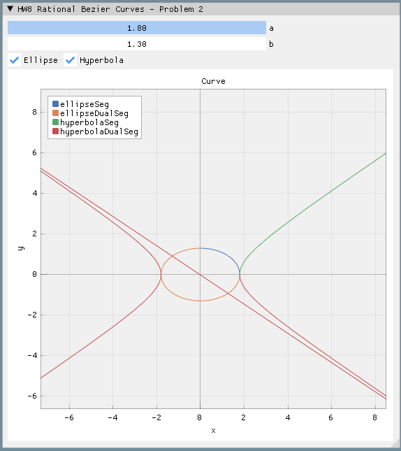

# CAGD 作业 8
刘紫檀 SA21229063

## 问题一

编程计算并绘出中心为 $ x $, 边长为 $2d$ 的立方体在 2 维平面上的透视投影，其中 $x$ 点和 $d$ 的大小由用户指定，对相机参数和方位进行合理假设。

### 分析

立方体的八个顶点为（$ \vec x = 0 $ 时）
$$
(d, d, d) \ 
(d, d, -d) \ 
(d, -d, d) \ 
(d, -d, -d) \\
(-d, d, d) \ 
(-d, d, -d) \ 
(-d, -d, d)  \ 
(-d, -d, -d) \
$$
设相机位置 $ (0, 0, z_0 ) $ ，像平面位置 $ z = \text{nearZ} $ ，则点 $ (x, y, z) $ 在像平面上的位置为
$$
x' = \text{nearZ} \times \frac{x}{z-z_0} \\
y' = \text{nearZ} \times \frac{y}{z-z_0}
$$
则可以认为每个点经过了这样的变换
$$
\begin{bmatrix}
x' \\ y' \\ z' \\ w'
\end{bmatrix} = 
\begin{bmatrix}
\text{nearZ} & 0 & 0 & 0 \\
0 & \text{nearZ} & 0 & 0 \\
0 & 0 & \text{nearZ} & 0 \\
0 & 0 & 0 & z-z_0 \\
\end{bmatrix}
\begin{bmatrix}
x \\ y \\ z \\ 1
\end{bmatrix}
$$

> 如果想要相机背面的内容不显示出来，只要变换后 clip 掉存在某些 $ w' < 0$ 的顶点的这些图元就行，这里没实现

将齐次坐标 $ (x', y', z', w') $ 转换为 $ (x'/w', y'/w', z'/w') $ 后，  将 $(x'/w', y'/w')$ 画出即可。

### 结果展示

## 问题二

用有理二次 Bezier 样条绘制椭圆
$$
\frac{x^2}{a^2} + \frac{y^2}{b^2} = 1
$$
和双曲线
$$
\frac{x^2}{a^2} − \frac{y^2}{b^2} = 1
$$
使得样条分段尽可能少。参数 $ a $ 和 $ b $ 由用户指定。

### 分析

#### 椭圆

从参数表示出发
$$
\left\{
\begin{aligned}
&x = a \cos t\\
&y = b \sin t
\end{aligned}
\right.
$$
带入
$$
\cos \varphi = \frac{1-\tan^2 \frac{\varphi}{2}}{1+\tan^2 \frac{\varphi}{2}},\quad
\sin \varphi = \frac{2\tan \frac{\varphi}{2}}{1+\tan^2 \frac{\varphi}{2}}
$$
则
$$
f(t) = (\frac{a(1-t^2)}{1+t^2 }, \frac{2bt}{1+t^2})
$$
转换为齐次坐标
$$
f(t) = (a(1-t^2), 2bt, {1+t^2})
$$
设 $ n=2 $ 的二次 Bezier 曲线为
$$
\vec f^{(hom)}(t) = \vec p_0 B_0^{(2)}(t)+ \vec p_1 B_1^{(2)}(t)+ \vec p_2 B_2^{(2)}(t)
$$
比较系数得
$$
\left\{
\begin{aligned}
a(1-t^2) = p_{0x}B_0^{(2)} + p_{1x}B_1^{(2)} + p_{2x}B_2^{(2)} \\
 2bt = p_{0y}B_0^{(2)} + p_{1y}B_1^{(2)} + p_{2y}B_2^{(2)} \\
{1+t^2} = p_{0z}B_0^{(2)} + p_{1z}B_1^{(2)} + p_{2z}B_2^{(2)} \\
\end{aligned}

\right.
$$
解得
$$
\begin{aligned}
\begin{bmatrix}
\vec p_0 & \vec p_1 & \vec p_2
\end{bmatrix}
&=
\begin{bmatrix}
a & 0 & -a \\
0 & 2b & 0 \\
1 & 0 & 1 \\
\end{bmatrix}
\begin{bmatrix}
1 & -2 & 1 \\
0 & 2 & -2 \\
0 & 0 & 1
\end{bmatrix}^{-1} \\
&= \begin{bmatrix}
a & 0 & -a \\
0 & 2b & 0 \\
1 & 0 & 1 \\
\end{bmatrix}
\begin{bmatrix}
1 & 1 & 1 \\
0 & \frac{1}{2} & 1 \\
0 & 0 & 1
\end{bmatrix}\\
&=
\begin{bmatrix}
a & a & 0 \\
0 & b & 2b \\
1 & 1 & 2
\end{bmatrix}
\end{aligned}
$$

#### 双曲线

从参数表示出发
$$
\left\{
\begin{aligned}
&x = a \sec t\\
&y = b \tan t
\end{aligned}
\right.
$$
带入
$$
\sec \varphi = \frac{1+\tan^2 \frac{\varphi}{2}}{1-\tan^2 \frac{\varphi}{2}},\quad
\tan \varphi = \frac{2\tan \frac{\varphi}{2}}{1-\tan^2 \frac{\varphi}{2}}
$$
则
$$
f(t) = (\frac{a(1+t^2)}{1-t^2 }, \frac{2bt}{1-t^2})
$$
转换为齐次坐标
$$
f(t) = (a(1+t^2), 2bt, {1-t^2})
$$
设 $ n=2 $ 的二次 Bezier 曲线为
$$
\vec f^{(hom)}(t) = \vec p_0 B_0^{(2)}(t)+ \vec p_1 B_1^{(2)}(t)+ \vec p_2 B_2^{(2)}(t)
$$
比较系数得
$$
\left\{
\begin{aligned}
a(1+t^2) = p_{0x}B_0^{(2)} + p_{1x}B_1^{(2)} + p_{2x}B_2^{(2)} \\
 2bt = p_{0y}B_0^{(2)} + p_{1y}B_1^{(2)} + p_{2y}B_2^{(2)} \\
{1-t^2} = p_{0z}B_0^{(2)} + p_{1z}B_1^{(2)} + p_{2z}B_2^{(2)} \\
\end{aligned}

\right.
$$
解得
$$
\begin{aligned}
\begin{bmatrix}
\vec p_0 & \vec p_1 & \vec p_2
\end{bmatrix}
&=
\begin{bmatrix}
a & 0 & a \\
0 & 2b & 0 \\
1 & 0 & -1 \\
\end{bmatrix}
\begin{bmatrix}
1 & -2 & 1 \\
0 & 2 & -2 \\
0 & 0 & 1
\end{bmatrix}^{-1} \\
&= \begin{bmatrix}
a & 0 & a \\
0 & 2b & 0 \\
1 & 0 & -1 \\
\end{bmatrix}
\begin{bmatrix}
1 & 1 & 1 \\
0 & \frac{1}{2} & 1 \\
0 & 0 & 1
\end{bmatrix}\\
&=
\begin{bmatrix}
a & a & 2a \\
0 & b & 2b \\
1 & 1 & 0
\end{bmatrix}
\end{aligned}
$$

#### 对偶圆锥曲线

观察到不管是椭圆的参数表示
$$
\left\{
\begin{aligned}
&x = a \cos t\\
&y = b \sin t
\end{aligned}
\right.
$$
还是双曲线的参数表示
$$
\left\{
\begin{aligned}
&x = a \sec t\\
&y = b \tan t
\end{aligned}
\right.
$$
如果带入半角公式的时候（$ t = \tan (\varphi/2)$）的换元中的 $ \varphi $ 能跑遍的话，那么参数表示也可以完整表示全部的曲线。一般的有理 Bezier 是定义在 $ [0, 1] $ 上的，现在我们想得到 $ (1, \infty) $ 和 $ (-\infty, 0) $ 的曲线，最简单的方法是做换元
$$
t = \frac{t_{\text{new}}}{2t_{\text{new}}-1}
$$
这样一波操作下来，我们发现 $ t_{\text{new}} $ 从 $[0, 1]$ 跑的时候，正好能跑到 $ t $ 取上面那两段。

带入换元，我们发现只要把 $ \vec p_1 $ 的分量加个负号，就还能用有理 Bezier 的方法来画整根曲线。

#### 绘制

按定义，用如下公式绘制即可

### 结果展示

## 问题三

在 3D 空间中绘制前一题中用齐次坐标表示的 Bezier 曲线（即做投影变换之前的三维曲线）。

> TODO: 其实很好画，但是 ImGui 要写单独的 Renderer 来渲染才行..
>
> 写了仨小时没写完，从零搓果然还是太费时间了

