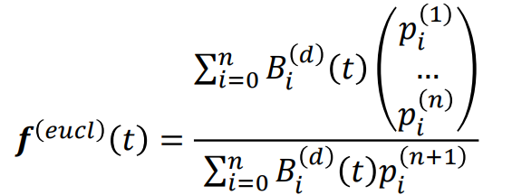
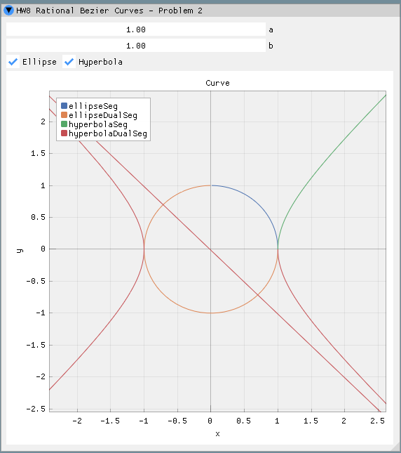
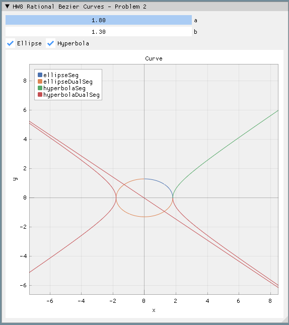

# CAGD 作业 9
刘紫檀 SA21229063

## 问题一

将单位球面用一张双 2 次有理 Bezier 曲面来表示，并绘制出来。

### 分析

单位圆的方程 $ x^2 + y^2 + z^2 = 1 $，记 $ r^2 = x^2 + y^2 $ 我们有 $ r^2 + z^2 = 1 $。利用单位圆的参数化我们可以得到

$$
\left\{
\begin{aligned}
r(u) = \frac{1-u^2}{1+u^2} \\
z(u) = \frac{2u}{1+u^2}
\end{aligned}
\right.
$$

用有理二次样条的方式表达如下

同时，我们对 $ x^2 + y^2 = r^2 \Rightarrow (x/r)^2 + (y/r)^2 = 1 $ 参数化，得到

$$
\left\{
\begin{aligned}
x(v) = r \frac{1-v^2}{1+v^2} \\
y(v) = r \frac{2v}{1+v^2}
\end{aligned}
\right.
$$

那么，我们可以得到参数表示

$$
\left\{
\begin{aligned}
&x(u, v) = \frac{1-u^2}{1+u^2} \frac{1-v^2}{1+v^2} &= \frac{(1-u^2)(1-v^2)}{(1+u^2)(1+v^2)} \\
&y(u, v) = \frac{1-u^2}{1+u^2} \frac{2v}{1+v^2} &= \frac{2v(1-u^2)}{(1+u^2)(1+v^2)} \\
&z(u, v) = \frac{2u}{1+u^2} &= \frac{2u(1+v^2)}{(1+u^2)(1+v^2)}
\end{aligned}
\right.
$$

这里有两种做法，一种是用待定系数，因为双 2 次有理 Bezier 曲面 9 个的基函数可以写出来，然后线性组合去拼就可以；另一种办法是用旋转曲面的构造方法（TODO）。

设方程为
$$
\vec f(u, v) = \sum_{i, j} \vec p_{ij} B_i(u) B_j(v)  
$$

则待定系数解得的系数如下：

> 待定系数的计算参见 `calc_control_points` 函数。

$$
p_{00}=\begin{pmatrix} 1\\  0\\  0\\  1\\ \end{pmatrix} 
p_{01}=\begin{pmatrix}  1\\   1\\  0\\   1\\ \end{pmatrix} 
p_{02}=\begin{pmatrix} 0\\   2\\  0\\   2\\ \end{pmatrix} \\
p_{10}=\begin{pmatrix}  1\\  0\\   1\\   1\\ \end{pmatrix} 
p_{11}=\begin{pmatrix} 1\\  1\\  1\\  1\\ \end{pmatrix} 
p_{12}=\begin{pmatrix} 0\\  2\\  2\\  2\\ \end{pmatrix} \\
p_{20}=\begin{pmatrix} 0\\  0\\   2\\   2\\ \end{pmatrix} 
p_{21}=\begin{pmatrix} 0\\  0\\  2\\  2\\ \end{pmatrix} 
p_{22}=\begin{pmatrix} 0\\  0\\  4\\  4\\ \end{pmatrix} \\
$$

### 对偶曲面

做换元
$$
t = \frac{t_{\text{new}}}{2t_{\text{new}}-1}
$$
这样一波操作下来，我们发现 $ t_{\text{new}} $ 从 $[0, 1]$ 跑的时候，正好能跑到 $ t $ 取上面那两段。

观察到

$$
\frac{ \sum_{ij} \begin{pmatrix}p_{ij_x} \\ p_{ij_y} \\ p_{ij_z} \end{pmatrix} B_i^{(2)}(\frac{u_{\text{new}}}{2u_{\text{new}}-1}) B_j^{(2)}(\frac{v_{\text{new}}}{2v_{\text{new}}-1})} { \sum_{ij} p_{ij_w} B_i^{(2)}(\frac{u_{\text{new}}}{2u_{\text{new}}-1}) B_j^{(2)}(\frac{v_{\text{new}}}{2v_{\text{new}}-1})}
$$

的效果就是让 $ \vec p_{01}, \vec p_{10}, \vec p_{21}, \vec p_{12} $ 的符号变成负的，那对偶曲面就比较好画了。

<!-- 
另一种想法是考虑这是一个旋转曲面的事实。
不用复杂的待定系数，其实这个曲面是 X-Z 平面的有理 Bezier 曲线 $ b_1(u) $ 和 X-Y 平面的有理 Bezier 曲线 $ b_2(v) $ 张成的，那么就可以自然写出齐次坐标形式
$$
\vec b_1(u) = \begin{pmatrix}1 \\ 0 \\ 0 \\ 1\end{pmatrix} B_0^{(2)}(u)+ \begin{pmatrix}1 \\ 0 \\ 1 \\ 1\end{pmatrix} B_1^{(2)}(u)+ \begin{pmatrix}0 \\ 0 \\ 2 \\ 2\end{pmatrix} B_2^{(2)}(u) \\
\vec b_2(v) = \begin{pmatrix}1 \\ 0 \\ 0 \\ 1\end{pmatrix} B_0^{(2)}(v)+ \begin{pmatrix}1 \\ 1 \\ 0 \\ 1\end{pmatrix} B_1^{(2)}(v)+ \begin{pmatrix}0 \\ 2 \\ 0 \\ 2\end{pmatrix} B_2^{(2)}(v) 
$$

然后作为向量积曲面 $ b_1(u) b_1(v) $ 就可以了。

$$
\begin{aligned}
b_1(u)b_2(v) = 
&\begin{pmatrix}1 \\ 0 \\ 0 \\ 1\end{pmatrix} B_0^{(2)}(u)B_0^{(2)}(v) + 
\begin{pmatrix}1 \\ 0 \\ 0 \\ 1\end{pmatrix} B_0^{(2)}(u)B_1^{(2)}(v) + 
\begin{pmatrix}0 \\ 0 \\ 0 \\ 2\end{pmatrix} B_0^{(2)}(u)B_2^{(2)}(v) + \\
&\begin{pmatrix}1 \\ 0 \\ 0 \\ 1\end{pmatrix} B_1^{(2)}(u)B_0^{(2)}(v) +
\begin{pmatrix}1 \\ 0 \\ 0 \\ 1\end{pmatrix} B_1^{(2)}(u)B_1^{(2)}(v) +
\begin{pmatrix}0 \\ 0 \\ 0 \\ 2\end{pmatrix} B_1^{(2)}(u)B_2^{(2)}(v) + \\
&\begin{pmatrix}0 \\ 0 \\ 0 \\ 2\end{pmatrix} B_2^{(2)}(u)B_0^{(2)}(v) +
\begin{pmatrix}0 \\ 0 \\ 0 \\ 2\end{pmatrix} B_2^{(2)}(u)B_1^{(2)}(v) +
\begin{pmatrix}0 \\ 0 \\ 0 \\ 4\end{pmatrix} B_2^{(2)}(u)B_2^{(2)}(v)
\end{aligned}
$$ -->

### 结果展示

## 问题二

用有理二次 Bezier 样条绘制椭圆
$$
\frac{x^2}{a^2} + \frac{y^2}{b^2} = 1
$$
和双曲线
$$
\frac{x^2}{a^2} − \frac{y^2}{b^2} = 1
$$
使得样条分段尽可能少。参数 $ a $ 和 $ b $ 由用户指定。

### 分析

#### 对偶圆锥曲线

观察到不管是椭圆的参数表示
$$
\left\{
\begin{aligned}
&x = a \cos t\\
&y = b \sin t
\end{aligned}
\right.
$$
还是双曲线的参数表示
$$
\left\{
\begin{aligned}
&x = a \sec t\\
&y = b \tan t
\end{aligned}
\right.
$$
如果带入半角公式的时候（$ t = \tan (\varphi/2)$）的换元中的 $ \varphi $ 能跑遍的话，那么参数表示也可以完整表示全部的曲线。一般的有理 Bezier 是定义在 $ [0, 1] $ 上的，现在我们想得到 $ (1, \infty) $ 和 $ (-\infty, 0) $ 的曲线，最简单的方法是做换元
$$
t = \frac{t_{\text{new}}}{2t_{\text{new}}-1}
$$
这样一波操作下来，我们发现 $ t_{\text{new}} $ 从 $[0, 1]$ 跑的时候，正好能跑到 $ t $ 取上面那两段。

带入换元，我们发现只要把 $ \vec p_1 $ 的分量加个负号，就还能用有理 Bezier 的方法来画整根曲线。

#### 绘制

按定义，用如下公式绘制即可

### 结果展示

## 问题三

在 3D 空间中绘制前一题中用齐次坐标表示的 Bezier 曲线（即做投影变换之前的三维曲线）。

> TODO: 其实很好画，但是 ImGui 要写单独的 Renderer 来渲染才行..
>
> 写了仨小时没写完，从零搓果然还是太费时间了

