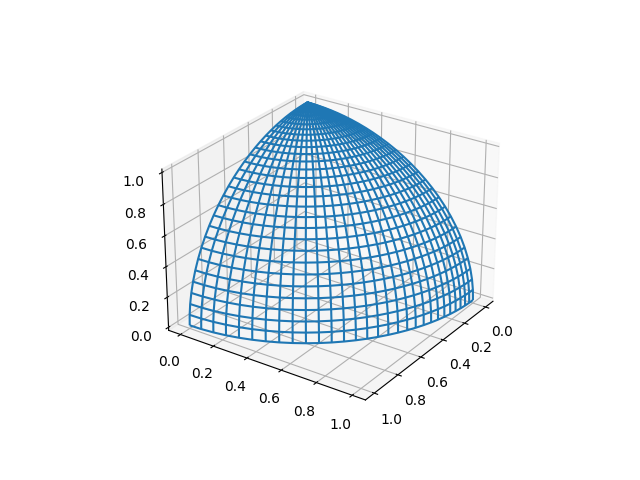

# CAGD 作业 9
刘紫檀 SA21229063

## 问题一

将单位球面用一张双 2 次有理 Bezier 曲面来表示，并绘制出来。

### 分析

单位圆的方程 $ x^2 + y^2 + z^2 = 1 $，记 $ r^2 = x^2 + y^2 $ 我们有 $ r^2 + z^2 = 1 $。利用单位圆的参数化我们可以得到

$$
\left\{
\begin{aligned}
r(u) = \frac{1-u^2}{1+u^2} \\
z(u) = \frac{2u}{1+u^2}
\end{aligned}
\right.
$$

用有理二次样条的方式表达如下

同时，我们对 $ x^2 + y^2 = r^2 \Rightarrow (x/r)^2 + (y/r)^2 = 1 $ 参数化，得到

$$
\left\{
\begin{aligned}
x(v) = r \frac{1-v^2}{1+v^2} \\
y(v) = r \frac{2v}{1+v^2}
\end{aligned}
\right.
$$

那么，我们可以得到参数表示

$$
\left\{
\begin{aligned}
&x(u, v) = \frac{1-u^2}{1+u^2} \frac{1-v^2}{1+v^2} &= \frac{(1-u^2)(1-v^2)}{(1+u^2)(1+v^2)} \\
&y(u, v) = \frac{1-u^2}{1+u^2} \frac{2v}{1+v^2} &= \frac{2v(1-u^2)}{(1+u^2)(1+v^2)} \\
&z(u, v) = \frac{2u}{1+u^2} &= \frac{2u(1+v^2)}{(1+u^2)(1+v^2)}
\end{aligned}
\right.
$$

这里有两种做法，一种是用待定系数，因为双 2 次有理 Bezier 曲面 9 个的基函数可以写出来，然后线性组合去拼就可以；另一种办法是用旋转曲面的构造方法。

<!-- TODO: 补充旋转曲面的构造方法 -->

设方程为
$$
\vec f(u, v) = \sum_{i, j} \vec p_{ij} B_i(u) B_j(v)  
$$

则待定系数解得的系数如下：

> 待定系数的计算参见 `calc_control_points` 函数。

$$
p_{00}=\begin{pmatrix} 1\\  0\\  0\\  1\\ \end{pmatrix} 
p_{01}=\begin{pmatrix}  1\\   1\\  0\\   1\\ \end{pmatrix} 
p_{02}=\begin{pmatrix} 0\\   2\\  0\\   2\\ \end{pmatrix} \\
p_{10}=\begin{pmatrix}  1\\  0\\   1\\   1\\ \end{pmatrix} 
p_{11}=\begin{pmatrix} 1\\  1\\  1\\  1\\ \end{pmatrix} 
p_{12}=\begin{pmatrix} 0\\  2\\  2\\  2\\ \end{pmatrix} \\
p_{20}=\begin{pmatrix} 0\\  0\\   2\\   2\\ \end{pmatrix} 
p_{21}=\begin{pmatrix} 0\\  0\\  2\\  2\\ \end{pmatrix} 
p_{22}=\begin{pmatrix} 0\\  0\\  4\\  4\\ \end{pmatrix} \\
$$

### 对偶曲面

做换元
$$
t = \frac{t_{\text{new}}}{2t_{\text{new}}-1}
$$
这样一波操作下来，我们发现 $ t_{\text{new}} $ 从 $[0, 1]$ 跑的时候，正好能跑到 $ t $ 取上面那两段。

观察到

$$
1 - t = \frac{t_\text{new}-1}{2t_\text{new}-1} \\

B^{(2)}_0(t) = \left(\frac{t_\text{new}-1}{2t_\text{new}-1}\right)^2 \\
B^{(2)}_1(t) = \frac{(2t_{\text{new}})(t_\text{new}-1)}{(2t_{\text{new}}-1)^2} \\
B^{(2)}_2(t) = \left(\frac{t_{\text{new}}}{2t_{\text{new}}-1}\right)^2
$$

所以下面的式子带入后的分母可以互相约去，而分子的效果就是让 $ B_1^{(2)}(t) $ 的符号颠倒。

$$
\begin{aligned}
&\qquad \frac{ \sum_{ij} \begin{pmatrix}p_{ij_x} \\ p_{ij_y} \\ p_{ij_z} \end{pmatrix} B_i^{(2)}(\frac{u  }{2u  -1}) B_j^{(2)}(\frac{v  }{2v  -1})} { \sum_{ij} p_{ij_w} B_i^{(2)}(\frac{u  }{2u  -1}) B_j^{(2)}(\frac{v  }{2v  -1})} \\
\end{aligned}
$$

而这个符号的变化我们可以放到控制点中去。

但是，对偶不是这么简单的。这个曲面其实是 X-Z 中的 1/4 弧和 X-Y 中的 1/4 弧张成的，我们其实想要的是 1/2 弧和 X-Y 中的 3/4 弧。

这个就要弄回原来的参数域想一个新的映射了，很可能没有这种系数直接颠倒就会成的好事。

> 展示一个颠倒 $ p_{1j}, \forall j $ 的全部系数的图
> 
> 

### 结果展示

程序是用 Python 3.8 + numpy + matplotlib 写的。待定系数计算控制点的程序也在其中。

> 构造 8 个 patch 就可以覆盖全部，或者用他和上面展示的 patch 作为一组 patch，共两组的话可以覆盖全部。

## 问题二

将椭球面 $ 3x^2 + 2y^2 + z^2 = 1 $ 用一张双 3 次有理 Bezier 曲面表示，并绘制出来。

### 分析

从椭球面的参数表示出发

$$
\vec f(u, v) = (\frac{1}{\sqrt 3}\frac{2u(1-u^2)}{(1+u^2)(1+v^2)}, \frac{1}{\sqrt 2}\frac{4uv}{(1+u^2)(1+v^2)}, \frac{(1+u^2)(1-v^2)}{(1+u^2)(1+v^2)})
$$

考虑开花形式

$$
F(u_1, u_2, u_3, v_1, v_2, v_3)
$$

> 找到开花形式的替换公式，带入就可以得到 $ F(0, 0, 0; 0, 0, 0) $ 到 $ F(1, 1, 1; 1, 1, 1) $ 的各个控制点。$ u, v $ 组内可以轮换（是对称的），但是组间显然不可以。

> TODO

## 问题三

某二次 Bezier 三角形有顶点参数坐标 $ a = (0, 0), b = (1, 0), c = (0.5, 1) $ 和以下控制点

$$
F(a, a) = \begin{pmatrix} 0 \\ 0 \\ 0 \end{pmatrix}
F(a, b) = \begin{pmatrix} 2 \\ 2 \\ 4 \end{pmatrix}
F(a, c) = \begin{pmatrix} 4 \\ -2 \\ 6 \end{pmatrix} \\
F(b, b) = \begin{pmatrix} 6 \\ -4 \\ 4 \end{pmatrix}
F(b, c) = \begin{pmatrix} 8 \\ 0 \\ 4 \end{pmatrix}
F(c, c) = \begin{pmatrix} 4 \\ 4 \\ 0 \end{pmatrix}
$$

问 $ p_1 = (0.25, 0.5), p_2 = (0.3, 0.75), p_3 = (0.5, 0.5) $ 中，哪个参数在三角形外？对于在三角形内的参数，用 de Casteljau 算法计算曲面 F(p, p) 在该参数处的坐标。

### 分析求解

容易知道 $ p_1 $ 在三角形的边上， $ p_2 $ 在三角形外，$ p_3 $ 在三角形内。

首先计算 $ p_3 $ 的重心坐标。列方程解后易得 
$$
p_3 = 0.25 a + 0.25 b + 0.5 c
$$

所以，
$$
\begin{aligned}
F(a, p_3) &= 0.25 F(a, a) + 0.25 F(a, b) + 0.5 F(a, c) \\
&= 0.25  \begin{pmatrix} 0 \\ 0 \\ 0 \end{pmatrix} + 0.25  \begin{pmatrix} 2 \\ 2 \\ 4 \end{pmatrix} + 0.5  \begin{pmatrix} 4 \\ -2 \\ 6 \end{pmatrix} \\
&= \begin{pmatrix} 2.5 \\ -0.5 \\ 4 \end{pmatrix} \\

F(b, p_3) &=0.25 F(b, a) + 0.25 F(b, b) + 0.5 F(b, c) \\
&= 0.25  \begin{pmatrix} 2 \\ 2 \\ 4 \end{pmatrix} + 0.25   \begin{pmatrix} 6 \\ -4 \\ 4 \end{pmatrix} + 0.5   \begin{pmatrix} 8 \\ 0 \\ 4 \end{pmatrix} \\
&= \begin{pmatrix} 6 \\ -0.5 \\ 4 \end{pmatrix} \\

F(c, p_3) &= 0.25 F(c, a) + 0.25 F(c, b) + 0.5 F(c, c)  \\
&= 0.25  \begin{pmatrix} 4 \\ -2 \\ 6 \end{pmatrix} + 0.25   \begin{pmatrix} 8 \\ 0 \\ 4 \end{pmatrix} + 0.5  \begin{pmatrix} 4 \\ 4 \\ 0 \end{pmatrix} \\
&= \begin{pmatrix} 5 \\ 1.5 \\ 2.5 \end{pmatrix} \\

F(p_3, p_3) &= F(0.25a + 0.25b + 0.5c, 0.25a + 0.25b + 0.5c) \\
&= 0.25 F(a, p_3) + 0.25 F(b, p_3) + 0.5 F(c, p_3) \\
&= \begin{pmatrix} 4.625 \\ 0.5 \\ 3.25 \end{pmatrix}

\end{aligned}
$$

